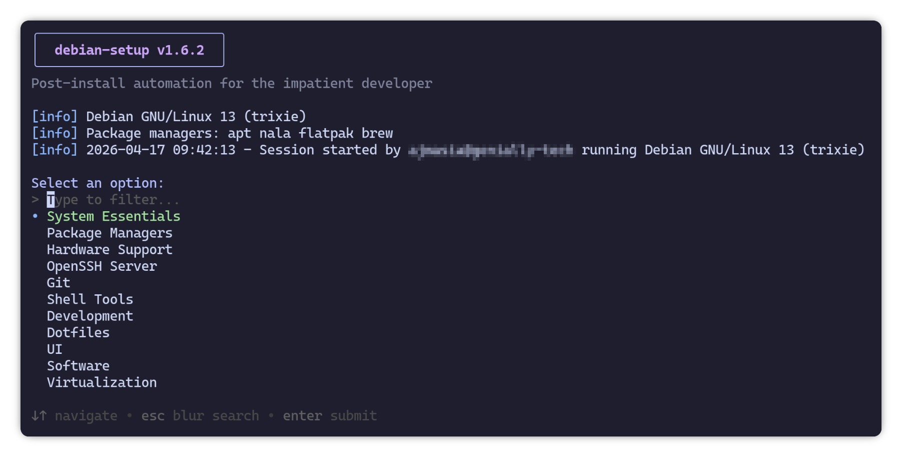

<p align="center">
  
</p>

# Debian Setup Script


Post-install automation for the impatient developer.

Interactive CLI tool that automates common Debian post-installation tasks: system configuration, package managers, development environments, virtualization, software installation, and more.

> Ubuntu support is actively being developed. Most modules work on Ubuntu 24.04+, with ongoing work to adapt distro-specific options (APT sources, GRUB, sudoers, kernel backports).



## Requirements

- Debian 13 (Trixie) — primary target
- Ubuntu 24.04+ — experimental
- [gum](https://github.com/charmbracelet/gum) — installed automatically by the installer

## Install

On a fresh Debian install, `curl` and `git` are not available and the user has no sudo access. Install them as root first:

```bash
su -c 'apt install -y curl git'
```

Then install debian-setup:

```bash
curl -fsSL https://raw.githubusercontent.com/ajmasia/debian-setup/main/install.sh | bash
```

This clones the repo to `~/.local/share/debian-setup` and creates two symlinks in `~/.local/bin`: `ds` (short) and `debian-setup` (long form).

> On a fresh install, start with **System Essentials > Sudoers** to grant sudo access to your user (uses `su` with the root password).

### Shell completions

After installing, enable tab completions for your shell:

```bash
ds --completions        # current shell
ds --completions bash   # bash only
ds --completions zsh    # zsh only
```

Completions work for both `ds` and `debian-setup`. Restart your shell to activate them.

## Usage

```
ds [options]
debian-setup [options]

Options:
  -v, --version             Show version
  -h, --help                Show this help message
  -s, --search              Global search across all tasks
  -si, --search-to-install  Search only tasks not yet applied
  -sr, --search-to-remove   Search only applied/installed tasks
  -l, --list                List all tasks (generates completion cache)
  -o, --option <name>       Jump directly to a task or category
  --completions [bash|zsh]  Install shell completions (default: current shell)
  --update                  Update to latest version
  --uninstall               Remove debian-setup
```

Run without options to start the interactive menu. Navigate with arrow keys, confirm with Enter, go back with Escape, exit with Ctrl+C.

## Features

### System Essentials

| Option | Description |
|--------|-------------|
| Sudoers | Manage `/etc/sudoers.d/${USER}` for sudo privileges |
| Password Feedback | Enable `pwfeedback` in sudoers (asterisks while typing password) |
| Default Editor | Set vim as default editor via `EDITOR`/`SUDO_EDITOR` in `~/.bashrc` |
| Zram Swap | Compressed RAM swap (zstd) via zram-tools |
| Inotify Watchers | Configure `fs.inotify` limits for development tools |
| GRUB | Configure GRUB resolution and background image |

### Hardware Support

| Option | Description |
|--------|-------------|
| Kernel | Install or revert the Linux kernel from Debian backports |
| Slimbook | Install Slimbook repository and EVO desktop meta-packages |

### Package Managers

| Option | Description |
|--------|-------------|
| System Upgrade | Update and upgrade all system packages |
| APT Sources | Manage sources: DEB822 format, components, backports, deb-src |
| Flatpak | Install or remove Flatpak with Flathub |
| Nala | Prettier frontend for APT |
| Nix | Nix package manager (multi-user daemon mode) |
| Homebrew | Homebrew package manager |

### OpenSSH Server

| Option | Description |
|--------|-------------|
| Server | Install and manage openssh-server with service control |
| Access | Set SSH access mode: pubkey-only, pubkey+password, or password-only |
| Keys | Generate and manage ED25519 SSH keys |
| Config | Manage `~/.ssh/config` entries for GitHub, GitLab and custom servers |
| Commit Signing | SSH-based git signing with `allowed_signers` and `includeIf` |

### Git

| Option | Description |
|--------|-------------|
| Git | Install git and configure global settings |

### Shell Tools

| Option | Description |
|--------|-------------|
| Utilities | Common CLI tools: fzf, bat, eza, ripgrep, fd, htop, btop, jq, yq, fastfetch |
| Starship | Cross-shell prompt |
| Zoxide | Smart directory jumper |
| Atuin | Shell history manager |
| Tmux | Terminal multiplexer |
| Zellij | Terminal multiplexer (Rust-based) |
| Dotfiles | Clone and apply dotfiles via GNU Stow |

### Development

#### Environments

| Option | Description |
|--------|-------------|
| Node.js | fnm (Fast Node Manager) + Node.js LTS |
| Python | uv (fast Python package manager) |
| Rust | Rust via rustup (rustc, cargo, rustup) |
| Go | Go programming language (APT or official tarball) |

#### Tools

| Option | Description |
|--------|-------------|
| Build Essentials | Core compilation tools and development libraries |
| GitHub CLI | `gh` — GitHub CLI |
| AWS CLI | AWS CLI v2 |
| Docker | Docker CE |
| HTTPie | Modern HTTP client |
| MongoDB Compass | MongoDB GUI |

#### AI

| Option | Description |
|--------|-------------|
| Claude Code | Claude Code CLI (native installer) |
| OpenCode | OpenCode (npm global) |
| GitHub Copilot CLI | Copilot CLI (gh extension) |
| AI Resources | Curated AI resources for development |

### UI

| Option | Description |
|--------|-------------|
| Keyboard | Keyboard layout, keybindings and fixed workspaces |
| Extensions | Manage GNOME Shell extensions |
| Fonts | Install Nerd Font families |

### Software

#### Browsers

| Option | Description |
|--------|-------------|
| Brave | Brave browser |
| LibreWolf | LibreWolf browser via extrepo |
| Mullvad Browser | Mullvad Browser |
| Chromium | Chromium browser |
| Google Chrome | Google Chrome browser |

#### Editors

| Option | Description |
|--------|-------------|
| VS Code | Visual Studio Code |
| Neovim | Neovim with LazyVim |

#### Terminals

| Option | Description |
|--------|-------------|
| Alacritty | Alacritty terminal (built from source) |
| Kitty | Kitty terminal |
| Ptyxis | Ptyxis terminal |

#### Productivity

| Option | Description |
|--------|-------------|
| GIMP | Image editor |
| Inkscape | Vector graphics editor |
| OnlyOffice | OnlyOffice Desktop Editors |
| LibreOffice | LibreOffice suite |
| Nextcloud | Nextcloud Desktop client + Nautilus integration |
| LocalSend | Local network file sharing |
| Balena Etcher | USB/SD card flasher |
| Obsidian | Note-taking app |
| Calibre | E-book manager |

#### Messaging

| Option | Description |
|--------|-------------|
| Telegram | Telegram Desktop |
| Slack | Slack |
| Discord | Discord |
| Element | Element Desktop |

#### Media

| Option | Description |
|--------|-------------|
| Media Packages | Media players, codecs and tools |
| Spotify | Spotify music client |

#### Security

| Option | Description |
|--------|-------------|
| Mullvad VPN | Mullvad VPN client |
| Proton VPN | Proton VPN client |
| Proton Pass | Proton Pass password manager |
| Proton Pass CLI | Proton Pass CLI |
| KeePassXC | KeePassXC password manager |
| Bitwarden CLI | Bitwarden CLI |
| Proton Authenticator | Proton Authenticator |
| Yubico Authenticator | Yubico Authenticator |
| YubiKey Manager | YubiKey Manager |
| Nitrokey App2 | Nitrokey App2 |
| OpenPGP | OpenPGP tools |

### Virtualization

| Option | Description |
|--------|-------------|
| QEMU/KVM | QEMU, libvirt, virt-manager with user groups and default network |

### Settings

| Option | Description |
|--------|-------------|
| System Health | System info, dependency status, task overview |
| Logs | View and clean session logs |
| Completions | Install/remove bash and zsh completions |
| About | Version, install path, shell, package managers |

## Architecture

```
debian-setup/
├── debian-setup                    # Entry point
├── install.sh                      # Installer and updater (curl | bash)
├── VERSION
├── CHANGELOG.md
├── completions/
│   ├── debian-setup.bash
│   └── debian-setup.zsh
├── src/
│   ├── lib/
│   │   ├── colors.sh              # Catppuccin Mocha palette
│   │   ├── gum.sh                 # gum wrappers (choose, filter, input, SIGINT)
│   │   ├── log.sh                 # Logging (terminal + file)
│   │   ├── apt.sh                 # APT list and .deb utilities
│   │   ├── system.sh              # System info (OS, distro, hardware)
│   │   ├── ui.sh                  # Persistent header, dirty flag, spin
│   │   └── xdg.sh                 # XDG Base Directory support
│   ├── menu.sh                    # Main menu, search, jump, task registry
│   └── modules/
│       ├── system/                # Sudoers, Editor, Zram, Watchers, GRUB
│       ├── packages/              # Upgrade, APT Sources, Flatpak, Nala, Nix, Homebrew
│       ├── ssh/                   # Server, Access, Keys, Config, Signing
│       ├── development/           # Environments, Tools, AI
│       ├── shell/                 # Utilities, Starship, Zoxide, Atuin, Tmux, Zellij, Dotfiles
│       ├── hardware/              # Kernel, Slimbook
│       ├── virtualization/        # QEMU/KVM
│       ├── software/              # Browsers, Editors, Terminals, Productivity, Messaging, Media, Security
│       ├── gnome/                 # Keyboard, Extensions, Fonts
│       └── settings/              # Health, Logs, Completions, About
└── packages/
    ├── apt/                       # APT package lists (one per line)
    ├── deb/                       # Direct .deb installers (name|url)
    ├── gnome/extensions.txt       # GNOME Shell extensions (uuid|label)
    ├── fonts/nerdfonts.txt        # Nerd Fonts (archive_name|label)
    ├── plymouth/themes.txt        # Plymouth community themes
    └── vscode/extensions.txt      # VS Code extensions (id|label)
```

Each module follows a consistent three-function pattern: `check` (returns 0 if already configured), `status` (human-readable description of pending work), and `apply` (interactive wizard). Top-level categories aggregate modules via task registries, enabling the global search and health check features.

## Design

- **Catppuccin Mocha** color palette throughout
- **XDG compliant** -- logs stored in `$XDG_STATE_HOME/debian-setup/logs/`
- **Session logging** -- all actions recorded to daily log files
- **Wizard pattern** -- each task shows current status and offers contextual actions
- **Non-destructive** -- every configuration change can be undone from the same menu
- **Repo cleanup** -- removing packages with external repos also removes the repo and GPG key
- **Ctrl+C safe** -- clean exit from any prompt via SIGINT handling
- **Distro-aware** -- options hidden or adapted based on the running distribution
